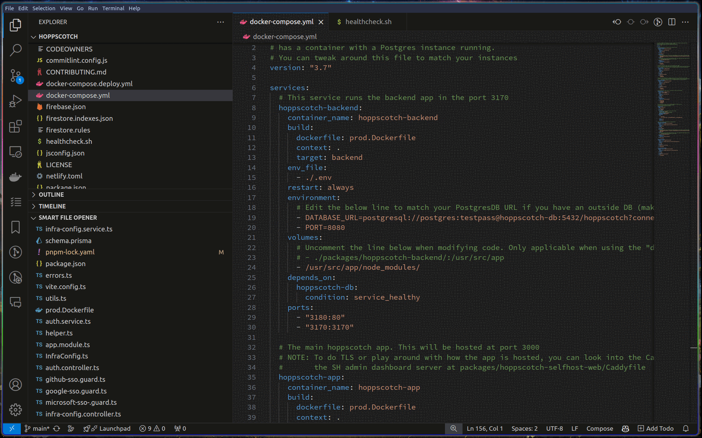

# Smart File Opener

Smart File Opener is a Visual Studio Code extension that enhances your productivity by recommending files to open based on your Git commit history. By analyzing commit frequencies and relationships between files, Smart File Opener helps you navigate your codebase efficiently, making it easier to focus on the most relevant files.

## Demonstration

## Features

- **Intelligent Recommendations**: Get smart file suggestions based on your project's commit history.
- **Context-Aware**: Recommendations are tailored to the currently opened file, helping you find related files quickly.
- **Performance Optimized**: Efficient analysis of recent commits ensures fast and relevant file recommendations.
- **Seamless Integration**: Works seamlessly with your existing Git repository and VSCode environment.
- **User-Friendly Interface**: Easily access recommendations through the command palette, a dedicated view in the Explorer area, or by double-clicking file names.

## Commands

1. **Smart File Opener: Open all recommended files**: Opens a specified number of recommended files based on your settings.
2. **Smart File Opener: Show recommended files to open**: Shows a list of recommended files for you to choose from.
3. **Smart File Opener: Open file**: Opens a file from the recommended list when double-clicked in the Explorer view.

## Settings

1. **smartFileOpener.commitLimit**: Limit of git commits to scan (default: 100).
2. **smartFileOpener.maxFilesToOpen**: Number of files to open when using "Open all recommended files" (default: 5, options: 5, 10, 20, -1 for all).
3. **smartFileOpener.autoUpdate**: Automatically update recommendations based on the current file (default: true).

## Keybindings

- `Ctrl+Alt+R` / `Cmd+Alt+R`: Open all recommended files.
- `Ctrl+Alt+S` / `Cmd+Alt+S`: Show recommended files to open.

## Installation

1. Open Visual Studio Code.
2. Go to the Extensions view by clicking on the Extensions icon in the Activity Bar on the side of the window or by pressing `Ctrl+Shift+X`.
3. Search for "Smart File Opener".
4. Click "Install" to install the extension.
5. Reload or restart VSCode to activate the extension.

## Usage

1. Open a project with a Git repository in VSCode.
2. Open the command palette by pressing `Ctrl+Shift+P`.
3. Type "Smart File Opener: Open all recommended files" or "Smart File Opener: Show recommended files to open" and select the command.
4. Follow the prompts to see and open the recommended files.
5. Alternatively, open the Explorer view and look for the "Smart File Opener" section to see recommended files based on the current file. Double-click a file name to open it.
